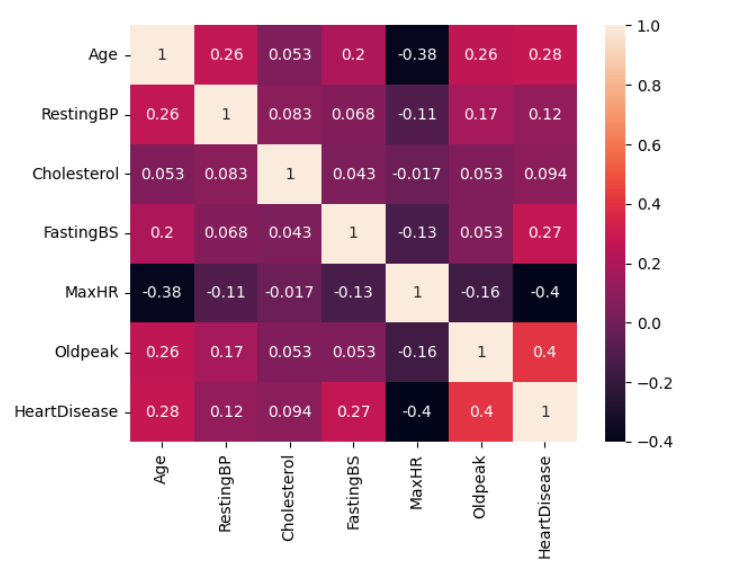
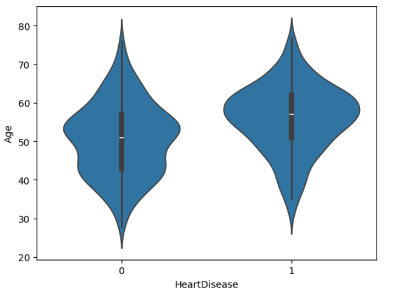
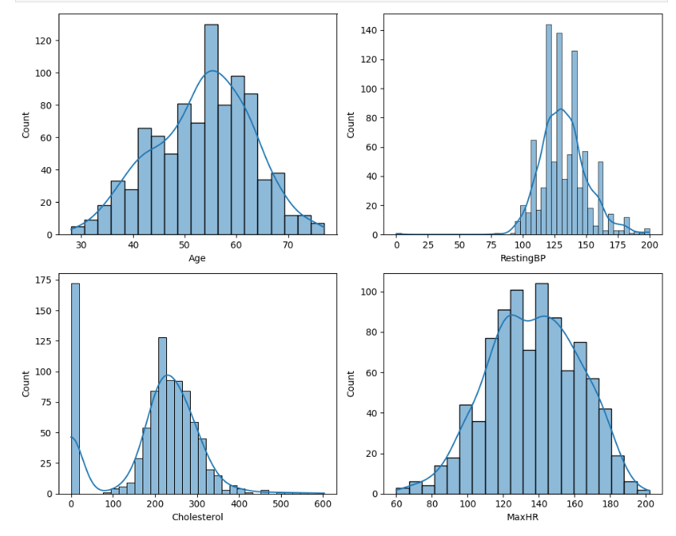
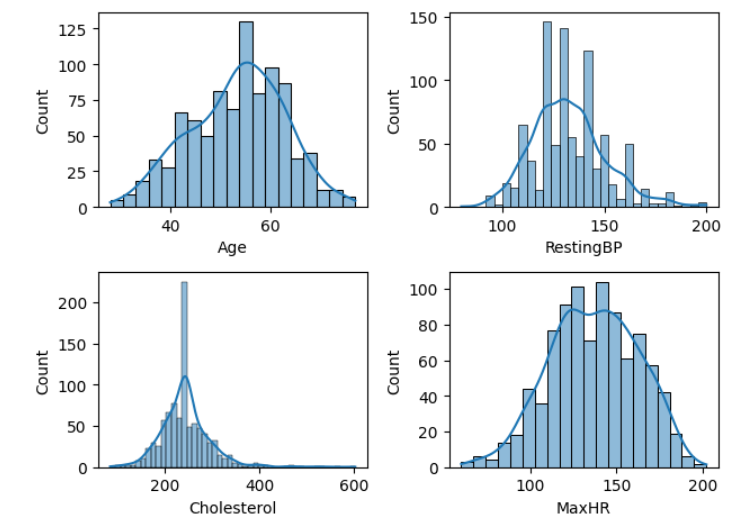

# Heart Disease: Exploratory Data Analysis & Feature Engineering

[](https://www.python.org/)
[](https://jupyter.org/)
[](#features)
[](#data-preprocessing--feature-engineering)

A professional-grade, end-to-end data exploration, cleaning, and preprocessing pipeline for cardiac patient data. This project lays down a robust foundation for building high-accuracy predictive classification models (e.g., predicting cardiovascular diseases) by performing thorough Exploratory Data Analysis (EDA) and converting raw, heterogeneous medical records into high-fidelity, standardized numerical features.

---

## Project Overview

Cardiovascular diseases (CVDs) are the leading cause of death globally, taking an estimated 17.9 million lives each year. Early detection and data-driven risk assessment are critical in clinical practice. 

This project analyzes a cohort of **918 patient records** with **11 clinical attributes** to identify key indicators of heart disease. The project includes:
1. **Structural Auditing & Quality Checks**: Verifying missing values, structural integrity, and duplicated entries.
2. **Exploratory Data Analysis (EDA)**: Visualizing demographic, statistical, and medical correlations.
3. **Feature Preprocessing Pipeline**: Handling categorical features through dummy encoding and scaling numerical metrics to prepare them for machine learning models.

---

## Tech Stack

* **Language**: Python 3.8+
* **Data Manipulation**: `pandas`, `numpy`
* **Data Visualization**: `seaborn`, `matplotlib`
* **Feature Engineering**: `scikit-learn` (specifically `StandardScaler`)
* **Environment**: Jupyter Notebook

---

## Dataset & Features

The project utilizes the **Heart Disease Dataset**, which consolidates several historical cardiac databases (such as Cleveland, Hungarian, Switzerland, and Long Beach V). 

### Dataset Statistics:
* **Total Records**: 918
* **Number of Features**: 11 clinical features + 1 target column (`HeartDisease`)
* **Class Balance**: 
  * **Heart Disease (1)**: 508 patients (55.3%)
  * **Normal (0)**: 410 patients (44.7%)

### Feature Directory:

| Attribute | Data Type | Description | Key Values / Ranges |
| :--- | :--- | :--- | :--- |
| **Age** | Numerical | Age of the patient | 28 to 77 years |
| **Sex** | Categorical | Gender of the patient | `M` (Male), `F` (Female) |
| **ChestPainType** | Categorical | Type of chest pain experienced | `TA` (Typical Angina), `ATA` (Atypical Angina), `NAP` (Non-Anginal Pain), `ASY` (Asymptomatic) |
| **RestingBP** | Numerical | Resting blood pressure in mm Hg | 0 to 200 mm Hg |
| **Cholesterol** | Numerical | Serum cholesterol in mg/dl | 0 to 603 mg/dl |
| **FastingBS** | Binary | Fasting blood sugar level | `1` (if FastingBS > 120 mg/dl), `0` (otherwise) |
| **RestingECG** | Categorical | Resting electrocardiogram results | `Normal`, `ST` (ST-T wave abnormality), `LVH` (Left ventricular hypertrophy) |
| **MaxHR** | Numerical | Maximum heart rate achieved | 60 to 202 bpm |
| **ExerciseAngina**| Categorical | Exercise-induced angina | `Y` (Yes), `N` (No) |
| **Oldpeak** | Numerical | ST depression induced by exercise relative to rest| -2.6 to 6.2 |
| **ST_Slope** | Categorical | The slope of the peak exercise ST segment | `Up`, `Flat`, `Down` |
| **HeartDisease** | Binary | **Target Variable**: Presence of heart disease | `1` (Heart Disease), `0` (Normal) |

---

## Key Features of the Analysis

### 1. Exploratory Data Analysis (EDA) & Visualizations
* **Distribution Audits**: Histograms with Kernel Density Estimation (KDE) curves for continuous clinical metrics (`Age`, `RestingBP`, `Cholesterol`, `MaxHR`) to detect skewness and range profiles.
* **Gender & Target Dissection**: Analysis of gender counts (`Sex` distribution) and their correlation to cardiovascular issues, showing a significant skew in positive diagnoses among males.
* **Symptom Mapping**: Frequency counts of `ChestPainType` compared with `HeartDisease` prevalence, highlighting that asymptomatic (`ASY`) chest pain highly correlates with a positive diagnosis.
* **Physiological Interaction Plots**:
  * *Box Plots*: Mapping `Cholesterol` levels across the target variable to isolate median ranges and outliers.
  * *Violin Plots*: Dissecting patient `Age` distributions across the target class to analyze density and probability shifts.
* **Multivariate Correlation Matrix**: Heatmaps showing Pearson coefficients of continuous numerical values to evaluate collinearity before model training.

### 2. Data Preprocessing & Feature Engineering
* **Categorical One-Hot Encoding**: Utilizing `pd.get_dummies` with `drop_first=True` to convert categorical text features (`Sex`, `ChestPainType`, `RestingECG`, `ExerciseAngina`, `ST_Slope`) into model-interpretable binary integers, preventing dummy variable traps.
* **Type Casting**: Ensuring full downstream computational safety by casting encoded features to standard integers.
* **Feature Scaling**: Implementing `StandardScaler` to calculate Z-scores for numerical features (`Age`, `RestingBP`, `Cholesterol`, `MaxHR`, `Oldpeak`), normalizing mean to `0` and variance to `1`. This steps prevents distance-based algorithms (e.g., SVM, KNN) and gradient-descent algorithms from being biased by feature scales.

---

## Results & Visual Insights

Based on the notebook analysis:
1. **High-Risk Demographics**: Males represent a significantly higher proportion of positive `HeartDisease` diagnoses compared to females.
2. **Symptom Danger Zones**: Patients experiencing asymptomatic chest pain (`ASY`) have a dramatically high frequency of actual heart disease, serving as a critical diagnostic predictor.
3. **Age Density Shift**: The violin plots illustrate that the median age for positive heart disease cases is shifted higher (mid-50s to late 60s) compared to normal cases.
4. **Data Optimization**: After scaling, all continuous variables have been transformed. Below is a sample preview of the processed features:
   
   | Age (Scaled) | RestingBP (Scaled) | Cholesterol (Scaled) | FastingBS | MaxHR (Scaled) | Oldpeak (Scaled) | HeartDisease |
   | :---: | :---: | :---: | :---: | :---: | :---: | :---: |
   | -1.433140 | 0.414885 | 0.834754 | 0 | 1.382928 | -0.727592 | 0 |
   | -0.478484 | 1.527224 | -1.210675 | 0 | 0.754157 | 0.282891 | 1 |
   | -1.751359 | -0.141284 | 0.722161 | 0 | -1.525138 | -0.727592 | 0 |

---

## Installation & Setup

Set up this project locally by following these steps:

### Prerequisite: Python
Make sure you have Python 3.8 or higher installed.

1. **Clone or Download the Project**:
   ```bash
   cd Heart
   ```

2. **Create a Virtual Environment** (Optional but highly recommended):
   ```bash
   # On Windows
   python -m venv venv
   venv\Scripts\activate
   ```

3. **Install Dependencies**:
   Install the required data science packages:
   ```bash
   pip install numpy pandas matplotlib seaborn scikit-learn notebook
   ```

---

## Usage

To run the analysis and feature engineering pipeline:

1. Launch the Jupyter Notebook interface:
   ```bash
   jupyter notebook
   ```
2. Open `Untitled.ipynb` from the notebook dashboard.
3. Execute the cells sequentially (`Shift + Enter`) to regenerate the EDA visualizations, check feature distributions, and output the scaled, encoded dataset.

---

## Screenshots & Visualizations

During execution, the notebook displays several high-resolution plots to interpret the data:

<table>
  <tr>
    <td align="center">
      <strong>Target Balance & Distributions</strong><br>
      
    </td>
    <td align="center">
      <strong>Outlier Detection (Violin Plot)</strong><br>
      
    </td>
  </tr>
  <tr>
    <td align="center">
      <strong>Before Scaling</strong><br>
      
    </td>
    <td align="center">
      <strong>After Scaling</strong><br>
      
    </td>
  </tr>
</table>


