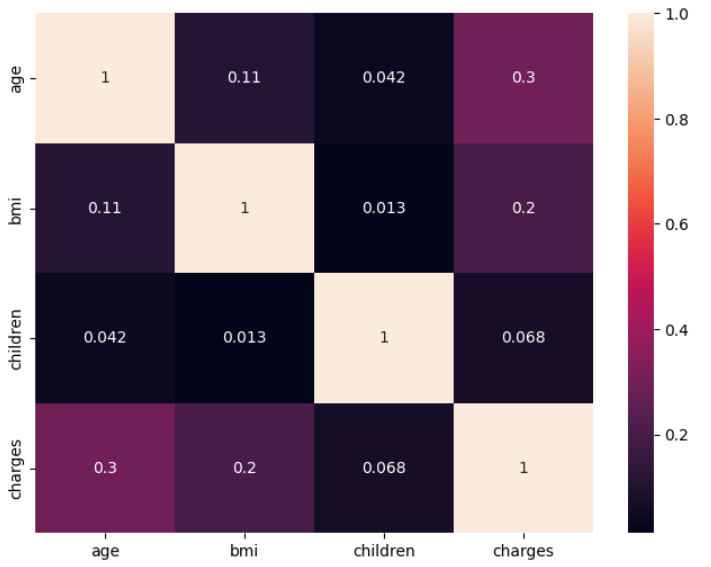
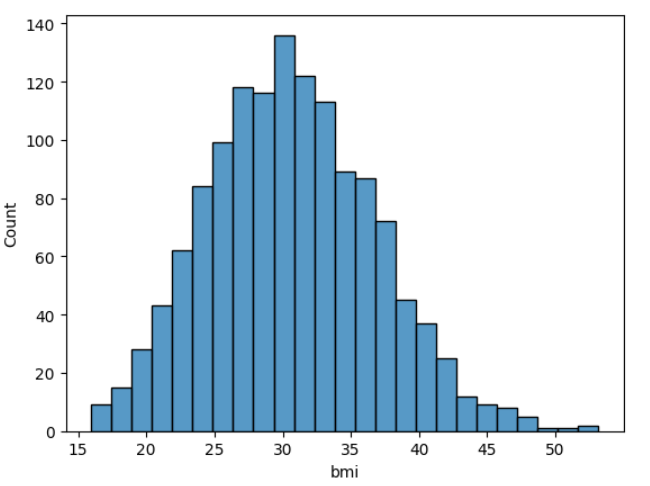

# Medical Insurance Costs: Statistical EDA & Feature Selection

[](https://www.python.org/)
[](https://jupyter.org/)
[](#6-statistical-hypothesis-testing--feature-selection)
[](#4-feature-scaling)

An advanced statistical data science pipeline designed to analyze and prepare US health insurance records for predictive pricing models. This project utilizes rigorous exploratory data analysis (EDA), custom clinical feature engineering, and dual statistical hypothesis testing—**Pearson Correlation Coefficient** for continuous variables and **Chi-Square ($\chi^2$) Test of Independence** for categorical features—to execute mathematical feature selection, guaranteeing a high-quality dataset for machine learning regression.

---

## Project Overview

Determining medical insurance premiums accurately is a core problem for actuarial science and insurance providers. By identifying the leading risk drivers (such as smoking, age, and body mass index) and validating their impact statistically, we can build robust, fair, and highly accurate pricing engines.

This project processes **1,338 detailed demographic records** through a complete data engineering workflow:
1. **Quality Checks**: Checking missing variables, duplicates, and general summary statistics.
2. **Exploratory Data Analysis (EDA)**: Profiling distributions of demographic variables (Age, Gender, Children, Region) and habits (Smoking).
3. **Clinical Feature Engineering**: Dissecting continuous BMI into standardized WHO clinical classifications.
4. **Z-Score Standardization**: Scaling numerical features to eliminate scaling bias in downstream modeling.
5. **Rigorous Feature Selection**: Running Pearson correlation ranks and Chi-Square tests to mathematically justify feature retaining decisions based on statistical significance ($\alpha = 0.05$).

---

## Tech Stack

* **Language**: Python 3.8+
* **Data Manipulation**: `pandas`, `numpy`
* **Data Visualization**: `seaborn`, `matplotlib`
* **Statistical Computing**: `scipy` (specifically `scipy.stats.pearsonr` and `scipy.stats.contingency.chi2_contingency`)
* **Preprocessing**: `scikit-learn` (specifically `StandardScaler`)
* **Environment**: Jupyter Notebook

---

## Dataset & Features

The project is built around the **US Medical Insurance Costs Dataset**, capturing health insurance expenses and patient details.

### Dataset Statistics:
* **Total Records**: 1,338 patients
* **Target Variable**: `charges` (Continuous: Annual medical insurance billing in USD)
* **Demographics**: Evaluates multi-regional demographics across the US.

### Feature Directory:

| Attribute | Data Type | Description | Key Values / Ranges |
| :--- | :--- | :--- | :--- |
| **age** | Numerical | Age of primary beneficiary | 18 to 64 years |
| **sex** | Categorical | Insurance contractor gender | `female`, `male` |
| **bmi** | Numerical | Body mass index (weight in kg / height in m²) | 15.96 to 53.13 kg/m² |
| **children** | Numerical | Number of children / dependents covered | 0 to 5 dependents |
| **smoker** | Categorical | Smoking status of the contractor | `yes`, `no` |
| **region** | Categorical | Beneficiary's residential area in the US | `southwest`, `southeast`, `northwest`, `northeast` |
| **charges** | Numerical | **Target Variable**: Individual medical costs | $1,121.87 to $63,770.43 USD |

---

## Key Features of the Pipeline

### 1. Advanced Exploratory Data Analysis (EDA)
* **Univariate Distribution Profile**: Plotting histograms with Kernel Density Estimations (KDE) for continuous characteristics to locate extreme charge distributions.
* **Frequency Outlining**: Count plots for discrete categories to identify balance across regions, dependent counts, genders, and habits.
* **Outlier Audits**: Utilizing box plots across continuous attributes to detect extreme price spikes and high-BMI outliers.
* **Correlation Heatmap**: Inspecting early visual Pearson indices between numeric columns.

### 2. Clinical Feature Engineering
* **WHO BMI Binning**: Adding domain logic by grouping continuous BMI into descriptive categorical bins (`Normal`, `Overweight`, `Obese`) using clinical benchmarks to capture non-linear relationships with charges.
* **Robust Encoding**: Performing dummy variable conversion (`pd.get_dummies` with `drop_first=True`) to seamlessly transform categorical attributes (`sex`, `smoker`, `region`, and the engineered `bmi_category`) into clean model-ready binary vectors, avoiding multi-collinearity.

### 3. Feature scaling (Standardization)
* **Standard Z-Score scaling**: Standardizing continuous fields (`age`, `bmi`, `children`) via `StandardScaler`. This brings their distributions to a mean of `0` and standard deviation of `1`, which is highly critical for regularization (Ridge, Lasso) and linear regression models.

---

## Statistical Hypothesis Testing & Feature Selection

To construct a parsimonious model, we run rigorous mathematical tests to filter features:

### 1. Continuous Features: Pearson Correlation Coefficient ($r$)
We calculate the linear relationship between our features and the target variable `charges`:

* **Smoking Status (`is_smoker`)** stands out as the single most critical driver of charges, presenting a massive positive correlation coefficient of **0.787**.
* **Age (`age`)** is the second strongest linear predictor, showing a solid positive correlation of **0.298**.
* **Obesity (`bmi_category_Obese`)** and **Continuous BMI (`bmi`)** also display positive relationships (~0.200 and ~0.196, respectively).

### 2. Categorical Features: Chi-Square ($\chi^2$) Test of Independence
To test if our categorical variables are statistically independent of the medical billings, we bin the continuous target variable `charges` into four equal quartiles (`charges_bin`) and perform contingency calculations against each feature. 

Using a significance threshold of **$\alpha = 0.05$**:

| Categorical Feature | Chi-Square ($\chi^2$) Statistic | $p$-value | Statistical Decision |
| :--- | :---: | :---: | :--- |
| **`is_smoker`** | 848.219 | **0.000000** | **Reject Null (Keep Feature)** |
| **`region_southeast`**| 15.998 | **0.001135** | **Reject Null (Keep Feature)** |
| **`is_female`** | 10.259 | **0.016490** | **Reject Null (Keep Feature)** |

* **Key Takeaway**: Smoking habit, gender, and living in the Southeast region all display statistically significant associations with medical charges ($p < 0.05$), validating their presence in our final feature matrix (`final_df`).

---

## Preprocessing Outputs

Below is a preview of the clean, structured, and scaled dataset generated by the end of the pipeline, fully prepared for ML modeling:

| age (Scaled) | is_female | bmi (Scaled) | children (Scaled) | is_smoker | charges (USD) | region_southeast | bmi_category_Obese |
| :---: | :---: | :---: | :---: | :---: | :---: | :---: | :---: |
| -1.440418 | 1 | -0.517949 | -0.909234 | 1 | 16884 | 0 | 0 |
| -1.511647 | 0 | 0.462463 | -0.079442 | 0 | 1725 | 1 | 0 |
| -0.799350 | 0 | 0.462463 | 1.580143 | 0 | 4449 | 1 | 0 |

---

## Installation & Setup

Get this analytical pipeline running on your machine with these simple steps:

### Prerequisite: Python
Ensure that Python 3.8 or higher is installed.

1. **Navigate to the Project Folder**:
   ```bash
   cd Insurance
   ```

2. **Create a Virtual Environment** (Highly recommended):
   ```bash
   # On Windows
   python -m venv venv
   venv\Scripts\activate
   ```

3. **Install Dependencies**:
   Install all required libraries including standard data science and statistical computing modules:
   ```bash
   pip install numpy pandas matplotlib seaborn scipy scikit-learn notebook
   ```

---

## Usage

To walk through the statistical research and dataset processing:

1. Open your terminal in the directory and launch Jupyter Notebook:
   ```bash
   jupyter notebook
   ```
2. Click on `Untitled.ipynb` from the local file hierarchy.
3. Run the notebook cells sequentially (`Shift + Enter`). You will observe libraries being installed/imported, data distributions visualized, WHO categorization logic, and the Pearson and Chi-Square outputs printed on screen.

---

## Visualizations & Screenshots

Running the notebook generates several high-resolution plots to interpret the data:

<table>
  <tr>
    <td align="center">
      <strong>Attribute Distributions & Correlations</strong><br>
      
    </td>
    <td align="center">
      <strong>BMI Distribution Analysis</strong><br>
      
    </td>
  </tr>
</table>

---